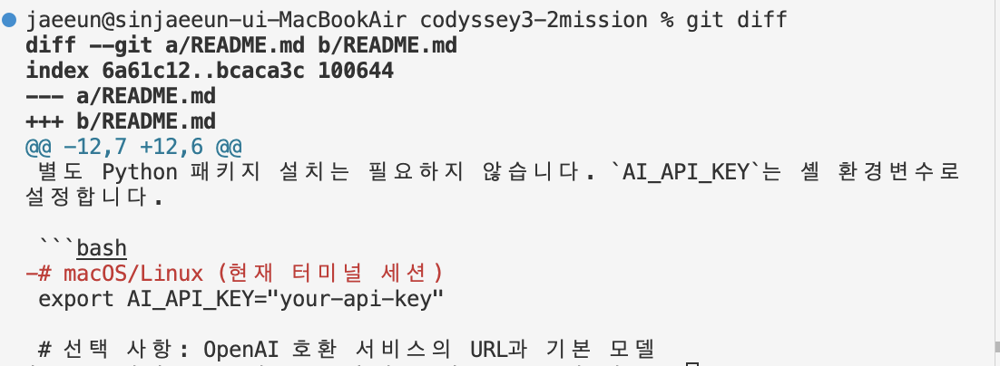

# AI Git Draft CLI

현재 Git 작업 트리의 변경 파일과 diff를 모아 AI API로 **커밋 메시지** 또는 **Pull Request 초안**을 생성하는 Python CLI입니다. 생성 결과는 검토용 텍스트로만 출력하며 `git commit`, `git push`, GitHub PR 생성을 실행하지 않습니다.

## 요구 사항
- Python 3.9 이상
- Git이 초기화된 저장소의 **루트 디렉터리**에서 실행
- OpenAI Chat Completions와 호환되는 API의 키

## 설치와 API 키 설정

별도 Python 패키지 설치는 필요하지 않습니다. `AI_API_KEY`는 셸 환경변수로 설정합니다.

```bash
export AI_API_KEY="your-api-key"

# 선택 사항: OpenAI 호환 서비스의 URL과 기본 모델
export AI_API_BASE_URL="https://api.openai.com/v1/chat/completions"
export AI_MODEL="gpt-4o-mini"
```

PowerShell에서는 다음처럼 설정합니다.

```powershell
$env:AI_API_KEY = "your-api-key"
```

키를 소스 코드, 명령행 인자, Git 저장소에 넣지 마세요. 키 설정 여부만 확인하려면 `echo $AI_API_KEY` 대신 셸의 환경변수 목록을 값 노출 없이 확인하세요.

## 실행 방법

저장소 루트에서 아래 명령을 실행합니다. 각 명령은 AI API를 **한 번** 호출합니다.

```bash
python3 gitdraft.py commit
python3 gitdraft.py pr
```

변경 이유와 팀 요구사항을 프롬프트에 추가할 수 있습니다.

```bash
python3 gitdraft.py commit --reason "로그인 오류 원인을 기록하기 위해" \
  --requirements "Conventional Commits 형식, 제목은 명령형으로 작성"
python3 gitdraft.py pr --reason "로그인 실패 분석을 쉽게 하기 위해" \
  --requirements "테스트하지 않은 내용을 테스트했다고 쓰지 말 것"
```

API 파라미터와 안전 모드는 옵션으로 조정합니다. 공통 옵션은 하위 명령 앞에 둡니다.

```bash
python3 gitdraft.py --model gpt-4o-mini --temperature 0.2 --max-tokens 700 --safe-mode commit
python3 gitdraft.py --temperature 0.1 --max-tokens 900 pr
```

| 옵션 | 기본값 | 역할 |
| --- | --- | --- |
| `--model` | `AI_MODEL` 또는 `gpt-4o-mini` | 사용할 API 모델 |
| `--temperature` | `0.2` | 낮을수록 응답 표현의 무작위성이 낮아져 형식 준수에 유리 |
| `--max-tokens` | `700` | 생성 응답 길이의 상한. 너무 낮으면 본문이 잘릴 수 있음 |
| `--safe-mode` | 꺼짐 | diff 최대 200줄/10파일 제한 및 흔한 키·이메일 패턴 마스킹 |
| `--reason` | 없음 | 변경 배경을 보충 |
| `--requirements` | 없음 | 템플릿, 길이, 표현 관련 요구사항을 보충 |

## 출력 예시

커밋 메시지:

```text
========== Commit Message ==========
fix(auth): explain login failure

- Add a useful message to the authentication error path.
- Update src/auth.py and tests/test_auth.py.
```

PR 초안:

```text
========== Pull Request ==========
제목: Explain authentication failures

## Why
- Make login failures easier to diagnose.

## What
- Add context to the authentication error response.

## How to Test
- Run the authentication test suite.
```

결과는 예시일 뿐이며 실제 생성 결과는 현재 diff와 제공한 이유/요구사항에 따라 달라집니다. 커밋 제목은 최대 72자, PR 제목은 최대 80자로 자르고, PR에는 `Why`, `What`, `How to Test` 각 섹션과 최소 한 개 불릿을 후처리로 보장합니다. 테스트 실행 사실은 diff만으로 확인할 수 없으므로 직접 검토해야 합니다.

## 처리 흐름과 함수 설명

1. `main()` 옵션을 읽고 프로젝트 루트인지 확인한 다음 변경 사항이 있는지 검사합니다. 
2. `require_repo_root()`는 `git rev-parse --show-toplevel` 결과와 현재 디렉터리를 비교합니다. 루트가 아니면 실행을 중단합니다.
3. `collect_changes()`는 `git status --short --branch`, `git status --porcelain`, `git diff --no-ext-diff --unified=3 HEAD`를 실행합니다. `git diff HEAD`는 추적 중인 staged/unstaged 변경을 함께 담습니다.
4. `--safe-mode`가 켜져 있으면 diff를 제한하고 `redact()`가 API 키로 보이는 문자열, GitHub 토큰, 이메일, `api_key`/`password` 같은 할당값을 가립니다.
5. `make_prompt()`는 변경 파일, 상태, diff, 변경 배경, 사용자의 형식 요구사항을 한 입력으로 묶습니다. 커밋과 PR은 서로 다른 출력 규칙을 사용합니다.
6. `call_ai()`는 `AI_API_KEY`를 `Authorization: Bearer ...` 요청 헤더에 넣어 JSON REST 요청을 보냅니다. HTTP 상태 오류, 네트워크 오류, 잘못된 응답은 원인과 함께 보고합니다. 키는 코드에 저장하지 않습니다.
7. `format_commit()`과 `format_pr()`가 길이와 구조를 후처리합니다. `format_pr()`는 필수 제목 및 섹션을 복구하고, 섹션에 불릿이 없을 때 검토자가 채울 안내 불릿을 넣습니다.
8. `main()`은 호출 횟수와 파일 목록, 구분된 최종 결과를 터미널에 출력합니다. 자동 커밋·push·원격 PR 생성은 하지 않습니다.

### `require_repo_root()` — 저장소 루트 확인  
Git으로부터 저장소의 최상위 경로를 알아낸 다음, 현재 실행 위치와 비교합니다. 저장소 안쪽의 하위 폴더에서 실행했다면 루트 경로를 알려주고 중단합니다.  

- `git rev-parse --show-toplevel`은 working tree 최상위 경로를 보여줍니다.

### `redact(text)` — 민감정보 패턴 마스킹
diff 문자열에서 흔한 API 키·토큰·비밀번호 형태와 이메일 주소를 정규식으로 찾아 [REDACTED] 등으로 바꿉니다.

- 이 함수는 collect_changes()가 안전 모드일 때 사용합니다.
- 정규식이 모든 종류의 비밀정보를 알아낼 수는 없으므로, 안전 모드는 완전한 민감정보 검사를 대신하지 않습니다.

### `collect_changes(safe_mode)` — Git 변경 사항 수집
`git status --short --branch`(사람용)와 `git status --porcelain`(컴퓨터용)으로 현재 상태와 변경 파일 목록을 수집하고, git diff로 변경 내용을 가져옵니다.




- 커밋 이력이 있는 저장소에서는 git diff HEAD를 사용해 staged와 unstaged 변경을 함께 확인합니다.
- 아직 첫 커밋을 만들지 않은 저장소에서는 HEAD가 없으므로 staged diff를 수집합니다.
- Git diff에 자동으로 포함되지 않는 새 파일은 파일 내용을 읽어 추가 행 형식으로 diff에 덧붙입니다.
- safe_mode=True이면 파일 목록을 최대 10개, diff를 최대 200줄로 제한하고 redact()를 적용합니다.

### `call_ai(prompt, model, temperature, max_tokens)` — REST API 호출
환경변수 AI_API_KEY를 읽어 API 요청의 Authorization: Bearer ... 헤더에 넣습니다. JSON 요청 본문에는 모델, temperature, max tokens, system/user 메시지를 담아 POST 요청을 보냅니다.

### `make_prompt(kind, changes, reason, requirements)` — 프롬프트 구성
변경 유형(commit 또는 pr), 변경 배경, 사용자가 지정한 요구사항, 파일 목록, Git 상태, diff를 하나의 프롬프트로 구성합니다.

### `clean_title(text, limit)` — 제목 한 줄 정리 및 길이 제한
제목 앞뒤 공백과 줄바꿈을 정리해 한 줄로 만들고, 제한 길이를 넘으면 잘라냅니다.

- 커밋 제목은 최대 72자, PR 제목은 최대 80자를 인자로 전달합니다.

### `format_commit(raw)` — 커밋 메시지 후처리
AI 응답의 첫 줄을 제목으로 취급해 clean_title()로 72자 이내로 정리합니다. 나머지 줄은 선택적인 본문으로 보존합니다. 응답이 비어 있으면 오류를 냅니다.

### `format_pr(raw)` — PR 제목과 본문 후처리
첫 줄을 최대 80자의 PR 제목으로 정리합니다. 본문에서는 Why, What, How to Test 섹션을 찾아 정해진 순서로 다시 구성합니다. 특정 섹션의 불릿이 빠졌다면 검토자가 내용을 보충하도록 기본 안내 불릿을 넣습니다.

### `build_parser()` - CLI 명령과 옵션 정의
argparse로 CLI 인터페이스를 정의합니다.

- **parser**는 입력된 문자열,데이터,코드 등을 규칙에 맞게 분해하고 해석하여 의미있는 구조로 만들어주는 프로그램이나 도구를 뜻합니다.
- os.getenv()는 운영 체제에 설정된 환경변수의 값을 읽어오는 함수입니다.
- **model**은 사용할 언어 모델을 선택합니다. 제공 업체 계정에서 사용할 수 있는 모델 이름이어야 합니다.
- **temperature**는 생성의 변동성을 조절합니다. (커밋 제목/템플릿처럼 일관성이 중요한 용도는 낮게 설정하고, 표현 다양성이 필요하면 높임) 값이 낮을수록 일관되고 결정론적인 답변을, 값이 높을수록 다양하고 독창적인 답변을 생성합니다. 이 CLI는 API에서 허용하는 통상 범위인 0~2를 검사합니다.
- **max_tokens**는 모델 응답에 사용할 최대 토큰 수입니다. 이 CLI는 요청당 한 번만 호출합니다.  
  700토큰 = 대략 영문500자 한글 300~500자.
- 요청 실패 시 자동 재시도하지 않습니다. 인증 오류(HTTP 401), 한도/요금 제한(HTTP 429), 서버 오류, 네트워크 오류는 오류 메시지를 확인한 뒤 조치하고 다시 실행합니다.

### main함수

1. build_parser()로 옵션을 읽습니다.
2. require_repo_root()로 현재 위치를 확인합니다.
3. collect_changes()로 파일과 diff를 모읍니다.
4. 변경 사항이 없으면 안내 메시지를 출력하고 종료합니다.
5. make_prompt()와 call_ai()로 결과를 한 번 생성합니다.
6. 명령 종류에 맞춰 format_commit() 또는 format_pr()로 다듬고 구분된 형태로 출력합니다.
7. 오류가 발생하면 오류 메시지를 출력하고 실패 종료 코드를 반환합니다.


## 보안 및 운영 주의사항

- diff에는 키, 개인정보, 고객 데이터가 들어갈 수 있습니다. 안전 모드를 켜고 실행 전 diff도 확인하세요. 정규식 마스킹은 모든 비밀 형식을 찾아내지 못하므로 민감정보를 완벽히 제거하는 보장은 없습니다.
- 안전 모드는 diff 앞부분 200줄과 파일 목록 앞 10개를 사용합니다. 중요한 변경이 뒤에 있으면 모델 맥락에서 빠질 수 있습니다.
- 저장소 루트에서 실행하되, 바이너리/대용량 파일이나 추적되지 않는 민감 파일을 먼저 제외하는 것이 좋습니다.
- 매 명령 한 번의 API 요청이 발생하며 제공 업체 요금 및 사용량 제한이 적용됩니다. 변경사항을 검토하고 필요한 명령만 실행하세요.
- 생성 문구는 초안입니다. 사실성, 테스트 방법, 팀의 커밋 규칙을 확인한 뒤 직접 사용하세요.

## 파일

```text
gitdraft.py   # CLI 구현
README.md     # 설정, 사용법, 함수 및 API 파라미터 안내
```
